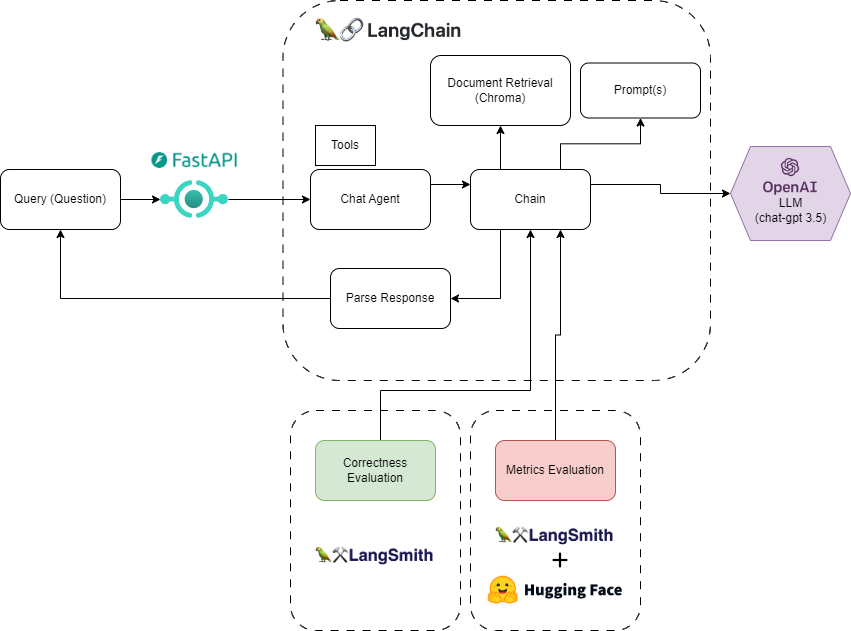

# Data RAG FAQ System

## Overall Architecture

This is a RAG QA system designed in the LangChain framework capable of answering questions related to 
mental health counseling. The Core of processing is designed with Langchain but it has the following interconnections

- Vector Store DB (Chroma) loaded from CSV file with questions-anwers pairs related to mental health-.
- Connection with the LLM `chat-gpt-3.5` of OpenAI 
- Use of FastAPI component to Expose an API to interact with this QA RAG system
- Evaluation of correctness through Langsmith Framework
- Custom Evaluator to connect to ether framework metrics evaluation models 



## Setup

### Pre-requisites

- Python 3.9 or higher
- Docker and docker-compose


### Steps

1. Define the following environment variables
```
OPENAI_API_KEY=<<your_api_key>>
LANGCHAIN_API_KEY=<<your_api_key>>
LANGCHAIN_ENDPOINT=https://api.smith.langchain.com
```
2. Run the python file [load_data.py](data%2Fload_data.py) to load the data from CSV files into vector store.
3. Start the application with the command
```
docker-compose up --build
```

## Integration

To interact with the FAQ system make POST requests to the URL http://localhost:8000/mh-rag-agent with the following format:

```
{
    "text": "<<your question>>"
}
```
## Evaluation of the model

Currently, only correctness evaluations have been made on the model, but in the future is planned to extend to another metrics evaluation models

More information about Correctness tests run is [here](test%2Fcorrectness_test.ipynb)